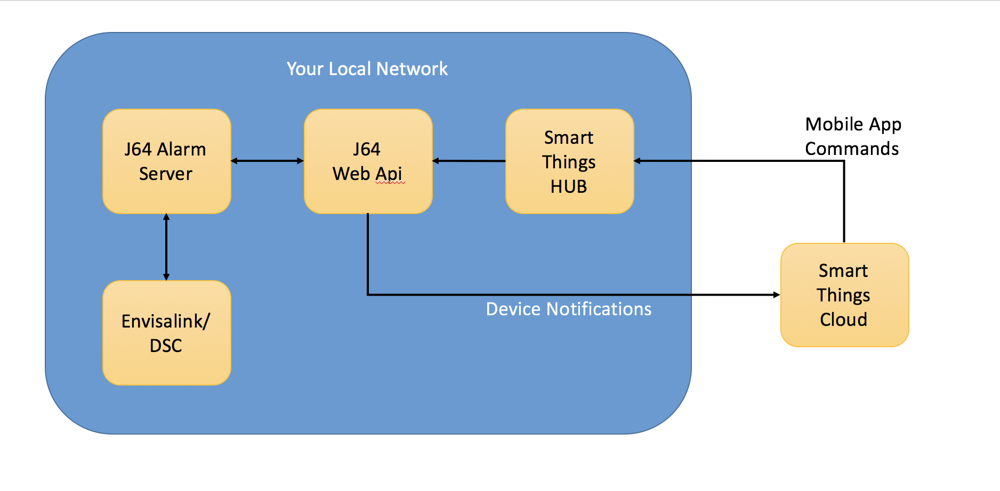

# j64.AlarmServer
A Server to integrate the Envisalink DSC controller with Smart Things

This server allows you to integrate the EnvisaLink DSC controller with the Smart Things Hub.  Once
integrated you are able to control you security system from the smart things hub and begin to do
things like automatically turning security on when you leave, incorporate your motion sensors into
smart things routines (turn lights on when motion is detected), integrate turning your security system on and off via the amazon echo and many other things.

The main reason I wrote this code was not because there was anything wrong with other AlarmServer packages that work with SmartThings, it was more because I wanted to learn a little bit about SmartThings development as well as learn how to use the new cross platform framework that MS has come out with Asp.NetCore 1.0. 

The following diagram illustrates how the various components of the solution interact with each other.

When the j64AlarmServer is started it opens a socket to the Envisalink controller.  The envisalink server will send information about the state of the alarm system back to j64AlarmServer including items such as whether a window is open, motion is detected or the alarm has been activated.  Likewise, the j64AlarmServer will send commands to Envisalink that will perform functions such as arming or disarming the security system.

As various events occur on the security sytem the j64AlarmServer will raise events.  These events can be caught by any applications that have subscribed to them.  In this case the j64WebApi will subscribe to those events and for certain events it will notify the smart things hub of the change.  For example if a window is opened that event is caught by j64AlarmServer and a web service call is made to the j64 Smart App that is running withing the Smart Things cloud.  From there the Smart App can take the appropriate action.  Typically this means notifying all of the devices that were defined for the controller and then propogating that state information out to the mobile app.

The smart things mobile app allows the user to trigger actions such as arming the security system.  When this occurs, the mobile app will talk to the devices running within the smart things cloud.  Those devices will then relay a web service call to the j64WebApi via the Smart Things Hub.  So it is the smart things hub that talks to the j64WebApi that is running on your local network.    The apps were designed to make a call to j64WebApi from the local network only to prevent the need to open up ports on the firewall that is protecting your local network.   

There is obviously alot more to how this all works.  You are encouraged to look at the code, make enhancements or suggest how I can improve on it.

If you are ready to get started on the install of the app, review the [GettingStarted.md](Documentation/GettingStarted.md) in the Documentation folder.  In there you will find instructions on how to get all the various parts and pieces up and running on your machine.
